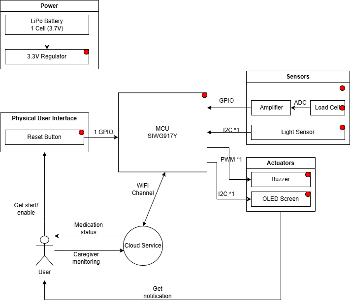
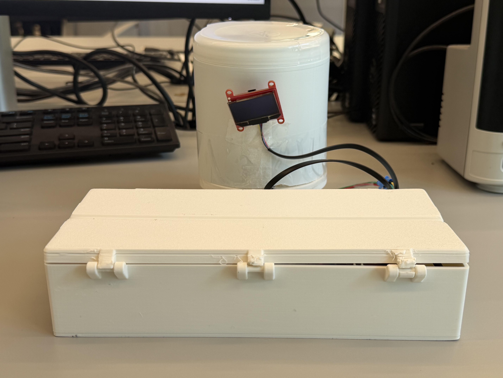
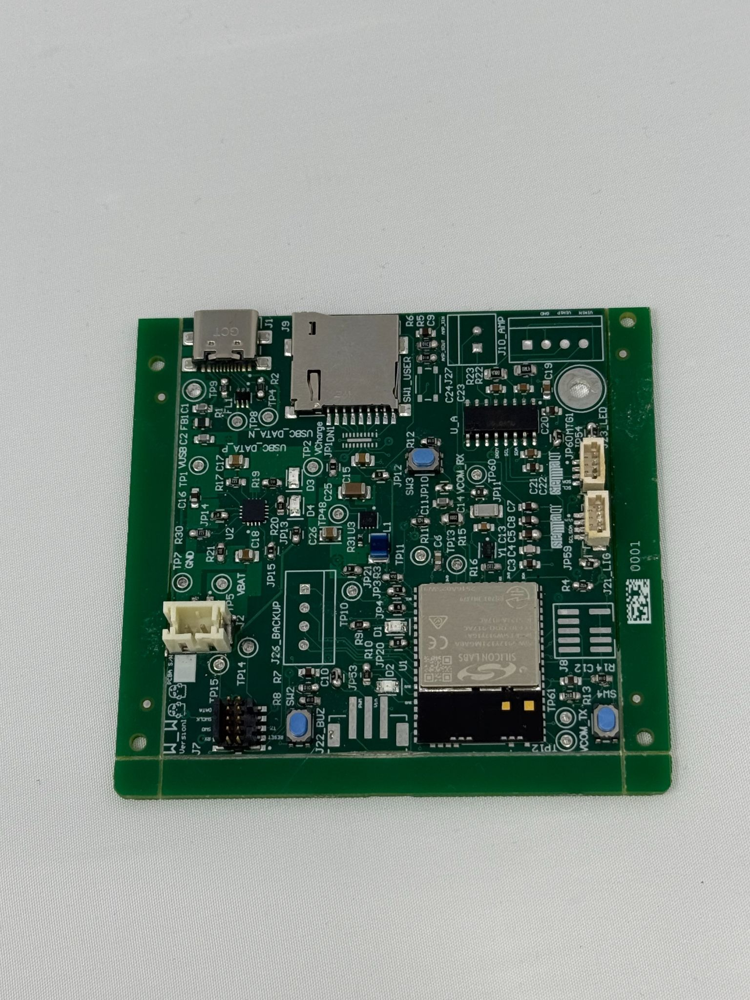
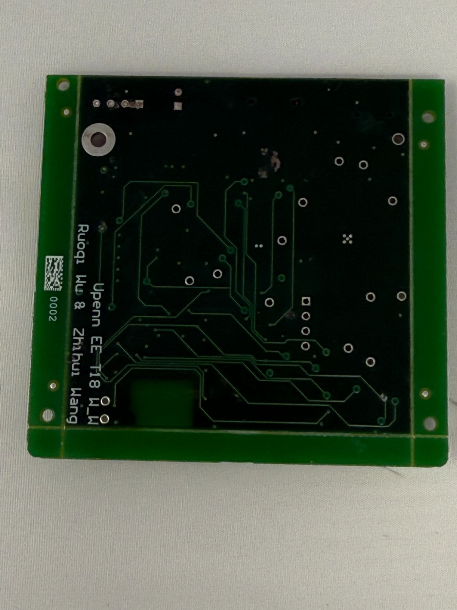
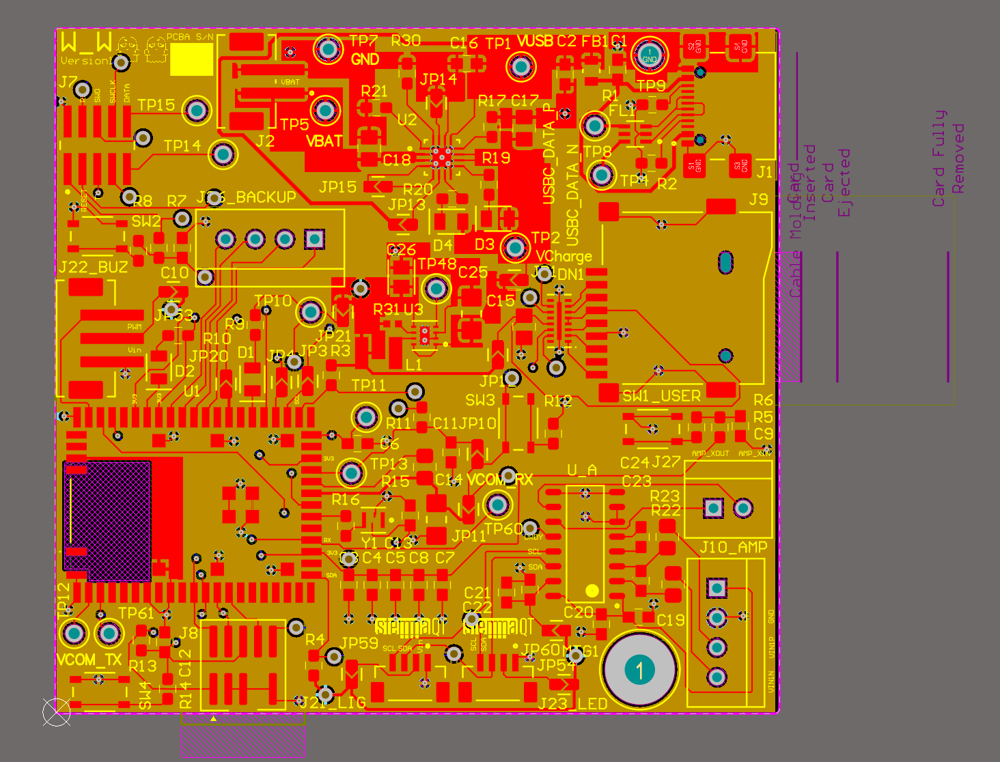
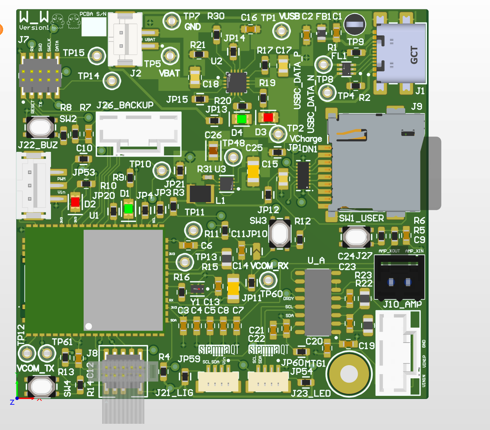
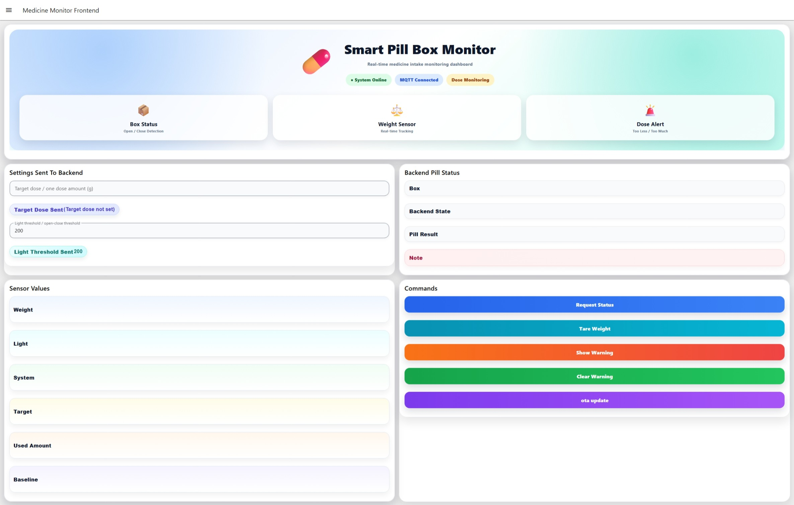
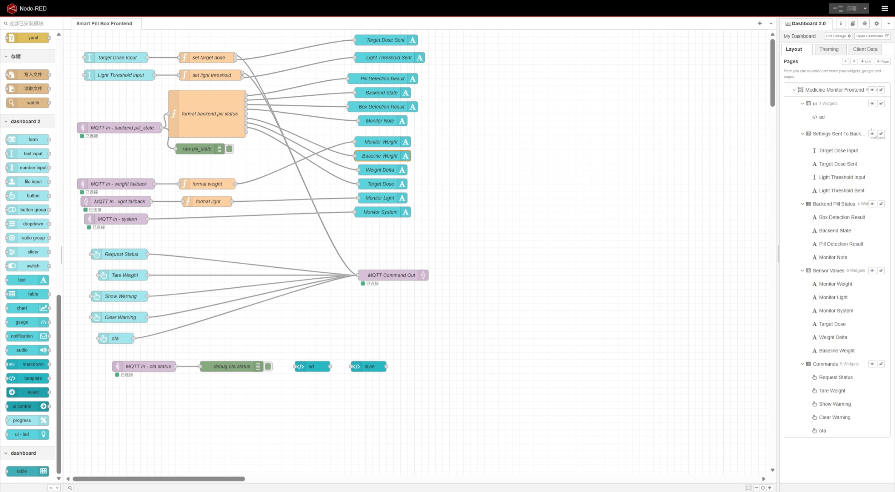

# a11g-final-submission

**Team Number: T18**

**Team Name: W_W**

| Team Member Name | Email Address         | GitHub Username |
| ---------------- | --------------------- | --------------- |
| Ruoqi Wu         | neorqi@seas.upenn.edu | rqW5            |
| Zhihui Wang      | wang52@seas.upenn.edu | [Username 2]    |

**GitHub Repository URL: https://github.com/ese5160/a11g-final-submission-s26-s26-t18-w_w.git**

## 1. Video Presentation

## 2. Project Summary

**Device Description**
Our project is a pill box that detects whether a box is opened and whether the expected amount of pills have been taken. The device combines light sensing, weight sensing, local display feedback, and a Node-RED dashboard to monitor medication taking behavior in real time.

This project was inspired by the common problem of missed doses, incorrect doses, and difficulty tracking medication usage. Our system helps detect medication taking events and classify whether the user took too less, the correct amount, or too much medication.

The Internet augments the system by allowing the device to send live sensor data to a Node-RED dashboard, receive thresholds of weight and state updates, and support ota firmware updates.

---

**Device Functionality**
The system uses a light sensor to determine whether the pill box is open or closed. A load cell measures the weight change of the medication container to estimate how much medication has been removed. An OLED and buzzer provides local status feedback, and the device communicates with Node-RED over Wi-Fi and MQTT.

**Main Components**

- SIWG917Y121MGABA (MCU)

Sensor:

- TSL2591 light sensor
- Load cell + HX711 amplifier

Actuators:

- OLED display
- Buzzer

**System Block Diagram**

---

**Challenges**
A major challenge in our project was getting the load cell subsystem to work reliably. We first tried using an I2C-based amplifier, but it was not fully compatible with our hardware in practice, so we were unable to obtain weight measurements. To overcome this problem, we changed to a different amplifier that worked better with our hardware and firmware setup. Once we made this change, the load cell started working properly and we were able to integrate weight-based pill detection into the system.

Another major challenge was separating system responsibilities across sensors and states. Early in development, it was difficult to keep box-open detection and medication-intake classification from interfering with each other. We ultimately restructured the system so that the light sensor only determines whether the box is open or closed, while the weight sensor is used to classify medication states such as `PILL_OK`, `PILL_MORE`, and `PILL_LESS`. This made the logic much clearer and more stable in both the dashboard and the embedded system.

---

**Prototype Learnings**

During this project, we learned that PCB design and fabrication are not the end of hardware development, but the beginning of system-level debugging. Some interfaces and connection schemes that looked reasonable during schematic capture and PCB layout only revealed problems after the board was fabricated, assembled, and brought up, especially in the areas of multi-peripheral integration, the load cell signal chain, and sensor interface compatibility. This taught us that hardware design cannot stop at being “electrically correct”; it must also take into account later firmware debugging, interface compatibility, and full-system integration.

This project also taught us that critical hardware paths must be validated as early as possible. For example, our original amplifier approach for the load cell did not work. From this, we learned that a component that seems feasible in theory may still fail in a real system, especially in analog sensing paths and mixed hardware firmware systems. Early board level validation and system integration testing are therefore essential.

If we were to build this device again, we would verify critical interfaces much earlier, plan board bring-up more systematically, and leave more time before fabrication for schematic review, pin verification, connector planning, and debugging access. We would also define the frontend, MQTT, and MCU side state interfaces earlier in the project to reduce repeated changes during integration.

---

**Next Steps & Takeaways**
Moving forward, we would like to further improve the robustness and accuracy of the system, especially for medication-state classification based on weight changes. We plan to continue refining the load cell calibration, threshold tuning, and abnormal case testing so that the system can more reliably distinguish between correct intake, under dose, and over dose conditions. We would also improve the enclosure and overall system integration, strengthen the OTA workflow, and add more complete event logging and data tracking so that the device can be more stable and practical in real-world use.

Through ESE5160, we learned that building a complete IoT system requires the coordination of hardware, embedded firmware, wireless communication, cloud/web interfaces, and system level debugging. More importantly than making individual modules work, we learned how critical it is to integrate the entire system reliably, maintain consistent interfaces, and validate the final prototype through real testing and demonstration.
---

**Project Links**

- **Node-RED Dashboard:** http://20.230.14.235:1880/dashboard/medicine-monitor-frontend
- **Altium 365 PCBA Link:** https://upenn-eselabs.365.altium.com/designs/155E52AA-0446-4E3F-AF4E-EC34210D7089#design

---

## 3. Hardware & Software Requirements

**Hardware Requirements Review**

| ID     | Requirement                                                                                                                                                  | Current Implementation                                                                                                                                                 | Validation Method / Evidence                                                                                                                                                         | Result / Status                                           |
| ------ | ------------------------------------------------------------------------------------------------------------------------------------------------------------ | ---------------------------------------------------------------------------------------------------------------------------------------------------------------------- | ------------------------------------------------------------------------------------------------------------------------------------------------------------------------------------ | --------------------------------------------------------- |
| HRS-01 | A single-cell LiPo battery (3.7V) shall be used as the primary power source for the device.                                                                  | The design intended to support battery-powered operation, but final validation was mainly performed with the development/power setup used during integration.          | Verified board bring-up and full-system operation during demo testing. Battery-only operation was not fully characterized in the final prototype.                                    | **Partially Met**                                   |
| HRS-02 | A 3.3V regulator shall be included to provide a stable 3.3V supply for the MCU and all peripherals.                                                          | The board and attached peripherals operate from a regulated 3.3V rail during normal use.                                                                               | Verified by successful operation of MCU, light sensor, OLED, load cell interface, and buzzer in integrated tests.                                                                    | **Met**                                             |
| HRS-03 | The SIWG917Y wireless MCU module shall be used as the main controller and shall provide Wi-Fi connectivity without requiring an external Wi-Fi module.       | The SIWG917Y MCU is the main controller and manages Wi-Fi/MQTT communication directly.                                                                                 | Verified through live MQTT communication with the dashboard and command/status topic exchange.                                                                                       | **Met**                                             |
| HRS-04 | A load cell shall be included to measure pill weight changes, and a signal amplifier/conditioning stage shall be used to interface the load cell to the MCU. | The final prototype includes a load cell measurement path and uses firmware APIs for tare, calibration, raw reading, and grams conversion.                             | Verified by live weight display, tare command support, baseline reset on the dashboard, and measured weight updates in operation.                                                    | **Met**                                             |
| HRS-05 | A light sensor shall be included to measure ambient light for interaction context.                                                                           | The device includes a light sensor and publishes light data to MQTT/Node-RED.                                                                                          | Verified by live value display on the dashboard and continuous light sampling in the system.                                                                                        | **Met**                                             |
| HRS-06 | A buzzer shall be included to provide audible reminders, and it shall be capable of producing alerts audible at typical indoor distances (≥ 1 meter).       | The device includes a buzzer and local warning behavior.                                                                                                               | Verified by local buzzer activation during warning state testing. Audible range was functionally demonstrated, though not formally quantified with a sound-level measurement setup. | **Partially Met**                                   |
| HRS-07 | An LED screen shall be included to present reminder and system status information to the user.                                                               | The final design uses an OLED display rather than an LED screen, but it provides local status display functionality.                                                   | Verified by OLED rendering of normal/warning/medication-state information in the integrated firmware.                                                                                | **Met (Design Change: OLED instead of LED screen)** |
| HRS-08 | The device shall include a physical On/Off button for user control of device power state.                                                                    | Power control button behavior was explored during development, but the final integrated demonstration did not rely on a fully validated user power state control path. | No final validated user-facing power-state demo included in the integrated system review.                                                                                            | **Partially Met / Not Fully Validated**             |

**Software Requirements Review**

| ID     | Requirement                                                                                                                                                                                                                                                      | Current Implementation                                                                                                                                                                                                                                                                                  | Validation Method / Evidence                                                                                                                             | Result / Status         |
| ------ | ---------------------------------------------------------------------------------------------------------------------------------------------------------------------------------------------------------------------------------------------------------------- | ------------------------------------------------------------------------------------------------------------------------------------------------------------------------------------------------------------------------------------------------------------------------------------------------------- | -------------------------------------------------------------------------------------------------------------------------------------------------------- | ----------------------- |
| SRS-01 | The system shall sample the load cell signal and compute a filtered weight estimate at least once every 1 second.                                                                                                                                                | The main application loop samples sensors continuously, and MQTT status publishing runs once per second.                                                                                                                                                                                                | Verified from the application loop and live dashboard weight updates.                                                                                    | **Met**           |
| SRS-02 | The system shall detect a pill removal event when the filtered weight decreases by at least a configured threshold within a 5-second window.                                                                                                                     | The Node-RED logic uses a configurable weight-drop threshold and baseline weight to classify medication events. However, the final implementation is threshold-based and does not explicitly enforce a strict 5-second event window in the current dashboard logic.                                     | Verified using dashboard threshold setup, baseline reset, weight delta display, and medication-status logic.                                             | **Partially Met** |
| SRS-03 | The system shall read the RTC and maintain scheduled reminder times with an error of no more than ±1 minute per day.                                                                                                                                            | RTC-based scheduling was part of the original design intent but was not fully demonstrated in the final prototype.                                                                                                                                                                                      | No final RTC accuracy characterization or scheduled-reminder timing validation was presented.                                                            | **Not Met**       |
| SRS-04 | When a reminder time occurs and no pill removal is detected within 5 minutes, the system shall alert the user locally using the buzzer and LED screen within 5 seconds.                                                                                          | The final prototype supports local warning behavior using buzzer + OLED, but not the full RTC-based autonomous reminder flow described in the original requirement.                                                                                                                                     | Warning behavior was demonstrated manually through dashboard/command flow rather than fully autonomous scheduled logic.                                  | **Partially Met** |
| SRS-05 | When a pill removal event is detected during an active reminder, the system shall stop the buzzer and update the LED screen status within 2 seconds.                                                                                                             | The system supports warning commands and medication-state display updates, but the exact automatic coupling between active reminder resolution and buzzer-stop timing was not fully validated as originally specified.                                                                                  | OLED state updates and warning-state control were demonstrated; full timed closed-loop validation was not completed.                                     | **Met**           |
| SRS-06 | After valid Wi-Fi credentials are provided, the system shall attempt to connect to the configured Wi-Fi network and report success/failure on the LED screen within 30 seconds.                                                                                  | The final firmware connects to Wi-Fi and publishes system status, but the exact provisioning + timed user display workflow was not fully demonstrated.                                                                                                                                                  | Wi-Fi operation was demonstrated through MQTT connectivity and system status, but not through the original provisioning UX path.                         | **Met**           |
| SRS-07 | When Wi-Fi is available, the system shall upload logged dose events (timestamp, status, and weight delta) to the cloud service at least once every 60 seconds, or within 30 seconds of an abnormal event.                                                        | The current implementation publishes live light, weight, and system data; Node-RED computes box state and medication state. Full timestamped dose-event logging/upload was not fully implemented as a cloud logging pipeline.                                                                           | Verified live MQTT status publishing and dashboard processing, but not complete dose-event logging/upload.                                               | **Partially Met** |
| SRS-08 | The system shall detect and log abnormal medication behavior, including (a) missed dose, (b) repeated removals within 10 minutes, or (c) weight change exceeding a configured “too many pills” threshold, and shall trigger a local warning within 10 seconds. | The current dashboard logic supports medication-state classification such as normal / too little / correct / too much medication, and the MCU supports OLED status modes and warning commands. However, the full abnormal-event logging and timed multi-condition rule set was only partially realized. | Verified medication-state classification on the dashboard and OLED mode support in firmware; full event logging and timing validation remain incomplete. | **Met**           |

## 4. Project Photos & Screenshots

**Final Integrated Device**

**PCBA Top**

**PCBA Bottom**

**Thermal Image**

**Altium 2D View**

**Altium 3D View**

**Node-RED Dashboard**

**Node-RED Backend**

## 5. Codebase

Do *not* commit any of your source code to this repository. Rather, provide links to the other GitHub repository you've already been using with your firmware.

- A link to your final embedded C firmware codebases
- A link to your Node-RED dashboard code
- Links to any other software required for the functionality of your device
